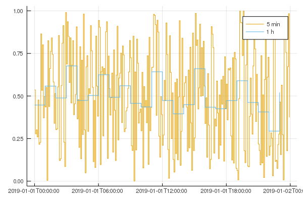
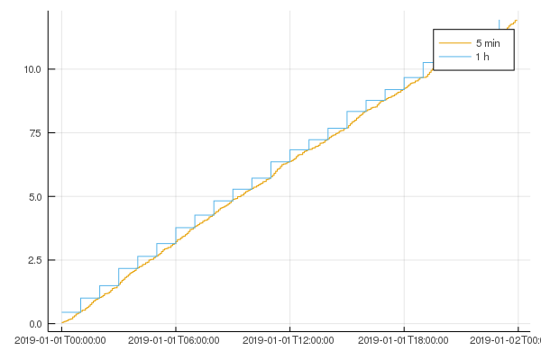

# Resample

[](https://travis-ci.com/daschw/Resample.jl)

This is a small utility package for resampling `Vector`s and `DataFrames` to new indices, e.g. a new time resolution.

## Install

```julia
julia> ]

pkg> add https://github.com/daschw/Resample.jl
```

## Usage

```julia
using Resample

resample(vec::AbstractVector, org_inds, new_inds, method = Mean())
resample(vec::AbstractVector, org_inds, step, method = Mean())

resample(df::DataFrame, index_col, new_inds, methods = Mean())
resample(df::DataFrame, index_col, step, methods = Mean())
```

Currently implemented methods are `Mean()`, `Sum()`, `First()` and `None()` (to ignore columns in a `DataFrame`).

### Vectors

Suppose we have some dummy data for energy and power profiles in a 5 minute resolution.
```julia
using Dates

times_long = DateTime(2019):Minute(5):DateTime(2019, 1, 31, 23, 55)
times_short = DateTime(2019):Hour(1):DateTime(2019, 1, 31, 23)

power_long = rand(length(times_long))
energy_long = power_long / 12
```

We can resample the data to the `times_short` resolution.
```julia
using Resample

power_short = resample(power_long, times_long, times_short)
energy_short = resample(energy_long, times_long, times_short, Sum())
```

With Plots we can illustrate the results.
```julia
using Plots
plot(times_long, power_long, label = "5 min", st = :step)
plot!(times_short, power_short, label = "1 h", st = :step)
```


```julia
plot(times_long, cumsum(energy_long), label = "5 min", st = :step)
plot!(times_short, cumsum(energy_short), label = "1 h", st = :step)
```


Instead of a vector of new indices a step length can be provided as well.
```julia
power_short_step = resample(power_long, org_inds, Hour(1))
power_short_step == power_short
```

### DataFrames

Suppose we have our data in a `DataFrame`.
```julia
using DataFrames

df = DataFrame(Time = times_long, Power = power_long, Energy = energy_long)
```

We can resample `df` by selecting the index column and specifying the methods for the remaining columns.
```julia
df1 = resample(df, :Time, Hour(1), [Mean(), Sum()])
```

If we want to ignore columns of the `DataFrame` for resampling we can pass the `None()` method.
```julia
df.Label = rand('a':'c', length(times_long))

df2 = resample(df, :Time, Hour(1); Energy = Sum(), Label = None())
df1 == df2
```

## Related Packages

- https://github.com/emenems/ResampleAndFit.jl
- https://github.com/femtotrader/TimeSeriesResampler.jl
